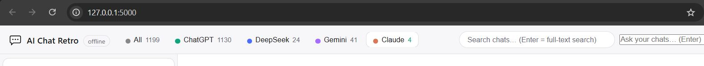

# AI-Chat-Retro

**ChatGPT backup viewer · DeepSeek history reader · Gemini export viewer — 100% offline, self-hosted, privacy-first**

Review all your past AI chat conversations from their export backups — **no cloud, no tracking, fully offline**. Your data never leaves your machine.

## Why AI Chat Retro?

If you've ever exported your ChatGPT data and struggled to actually **read** it, this tool is for you. AI Chat Retro is a free, open-source **ChatGPT export viewer** and **DeepSeek chat history reader** that parses your AI chat backups and turns them into a clean, browsable, searchable interface — entirely offline.

- **100% local** — no data leaves your machine, no accounts, no analytics
- **Multi-service** — reads exports from ChatGPT, DeepSeek, and Gemini in one place
- **Self-hosted** — runs on your laptop or homelab, Docker included
- **Privacy-first** — ideal for GDPR data export viewing and personal data portability
- **Zero dependencies** beyond Python and Flask — lightweight and fast

## What it does

Loads every chat export under `exports/` (ChatGPT, DeepSeek, Gemini) and shows them in a familiar
chat UI: all your conversations in a sidebar, click any of them to scroll and re-read the full
history, search across everything, and review chats from multiple services side by side. It behaves
like the online chat apps — but uses **only your local data** and never touches the internet.

## UI



The main window shows your chats in a searchable sidebar on the left (grouped by service tabs:
All / ChatGPT / DeepSeek / Gemini), with the selected conversation rendered as user/assistant
chat bubbles in the main pane. The top bar holds the brand, live search box, and the Stats
button.

## Prep

1. **Download** your AI chats as `backup.zip` from each service.
2. **Save** each zip into a folder named after the service under `exports/`, e.g.:
   - `exports/chatgpt/`
   - `exports/deepseek/`
   - `exports/gemini/`
3. **Extract** each zip — inside you'll find `conversations*.json` (or `MyActivity.json` /
   `conversations.json`). These files **are** your past chats; the app reads them directly.

> A reference listing of the current sample export layout is in
> [`data-export-reference-conversations.txt`](data-export-reference-conversations.txt).

## How to Run

```bash
cd aichatretro
pip install flask
python3 app.py
```

Then open **http://localhost:5000** in your browser.

- The app **parses your `exports/` folder every time it starts** — no prebuilt data, no cache; each
  person's exports are loaded fresh.
- It binds to `127.0.0.1` by default, so it is reachable only from this machine.

### Running inside WSL (Windows browser)

If the app lives under WSL but your browser is on Windows, `localhost` forwarding usually works —
but if you ever see a **blank/dark page** (the page loads but no chats appear, or the startup-error
banner shows), bind to all interfaces and reach it via the WSL IP instead:

```bash
AICR_HOST=0.0.0.0 python3 app.py
ip addr show eth0 | grep inet        # note the WSL IP, e.g. 172.23.63.0
```

Then open **http://172.23.63.0:5000** (or `http://localhost:5000` if that works) and **hard-refresh
with Ctrl+F5** once so the browser drops any cached old CSS/JS. The app is still local-only — it is
reachable on your LAN, not on the public internet.

### Docker (Docker Desktop on Windows)

The easiest way to run the app — no Python install needed on the host.

**Prerequisites:**
- [Docker Desktop for Windows](https://www.docker.com/products/docker-desktop/) installed and running.

**Steps:**

1. Place your chat exports in the `exports/` folder (see [Prep](#prep) above).
2. Open a terminal in the project folder and build + start:
   ```bash
   docker compose up -d --build
   ```
3. Open **http://localhost:5000** in your browser (Docker Desktop forwards port 5000 to localhost).

**Day-to-day commands:**

| Action | Command |
| --- | --- |
| Start (first time or after code change) | `docker compose up -d --build` |
| Restart (after adding new exports) | `docker compose restart` |
| Stop | `docker compose down` |
| View logs | `docker compose logs -f` |
| Rebuild from scratch | `docker compose down && docker compose up -d --build` |

**How it works:**
- The container runs Flask with `AICR_HOST=0.0.0.0` (required — without this, port mapping silently fails as a dead page).
- Your `exports/` folder is mounted **read-only** into the container — the app never modifies your data.
- Code changes (HTML/CSS/JS) require `docker compose up -d --build` to rebuild the image.
- New exports only require `docker compose restart` (the app re-parses on every start).

| Action | What happens |
| --- | --- |
| Browse | All chats listed in the sidebar, grouped by service tabs (All / ChatGPT / DeepSeek / Gemini) |
| Filter | Type in the top search box to narrow the list live |
| Full-text search | Press **Enter** in the search box for cross-chat snippet results |
| Review | Click any conversation to read it as chat bubbles — images, reasoning, citations, voice transcripts included |
| Stats | Top-right **Stats** button shows counts per service and per model |

## Use Cases

- **ChatGPT backup viewer** — read your exported ChatGPT conversations offline, no internet needed
- **DeepSeek chat history reader** — browse and search your DeepSeek export backups locally
- **Gemini export viewer** — view Google Gemini conversation exports in a clean chat UI
- **AI chat history search** — full-text search across all your past AI conversations from one place
- **GDPR data export viewer** — easily read and review your personal AI data exports
- **Self-hosted AI chat archive** — keep a local, private archive of all your AI interactions
- **Analytics** — counts per service, per model, and date ranges (Stats button)
- **RAG with your data** — offline "Ask": ask natural-language questions over your exported chats
- **Data portability** — own and access your AI conversation data on your own terms

## Tech stack

- **Backend:** Python · Flask · no third-party dependencies beyond Flask
- **Frontend:** vanilla HTML/CSS/JS single-page app, hand-written offline markdown renderer (no CDN)
- **Parsers:** one module per service (`parsers/`) normalizing every export format to one schema

See [PLAN.md](PLAN.md) for architecture, the unified data schema, API surface, and edge cases handled.
For the optional offline **Ask / RAG** feature (natural-language questions over your chat history,
SQLite+FTS5 index), see [`rag/RAG-README.md`](rag/RAG-README.md).

## Browser Support

Use a current version of Chrome, Edge, Firefox, or Safari (Safari 14.1+). Internet Explorer 11 is not supported.

---

## Search Keywords

*These are for discoverability — if you found this project by searching for any of these, it was intentional:*

> ChatGPT export viewer, ChatGPT backup viewer, view ChatGPT conversations offline, read ChatGPT data export, ChatGPT history browser, DeepSeek chat export viewer, DeepSeek backup reader, Gemini export viewer, AI chat history viewer, AI conversation backup, self-hosted AI chat viewer, offline AI chat browser, ChatGPT JSON viewer, ChatGPT data portability, GDPR AI data export, local AI chat archive, ChatGPT chat reader, AI chat backup tool, no cloud AI chat viewer, privacy-first AI tool
